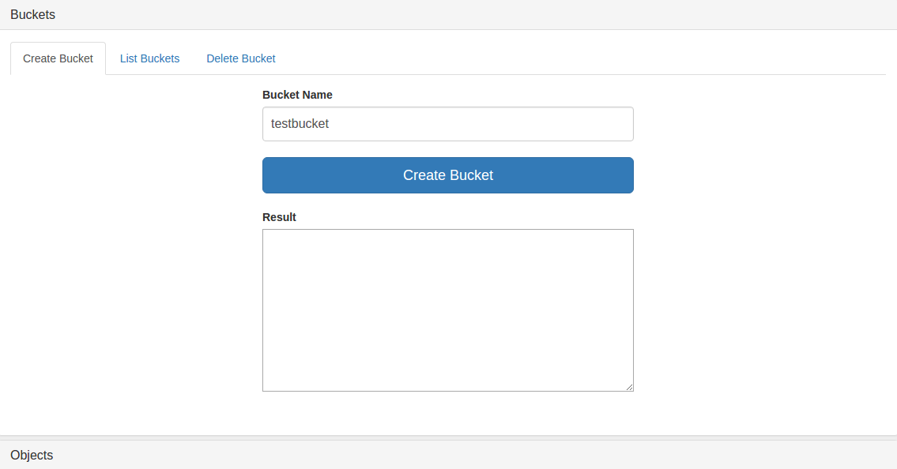
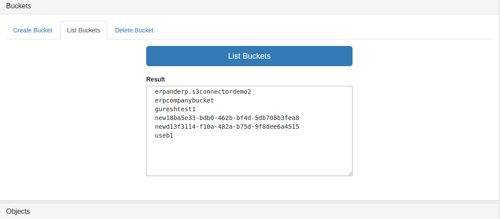
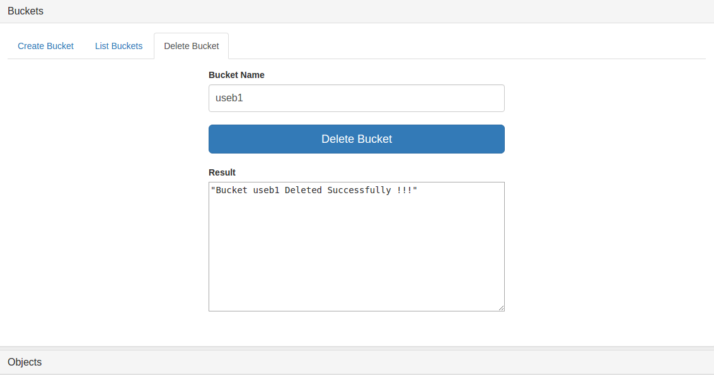
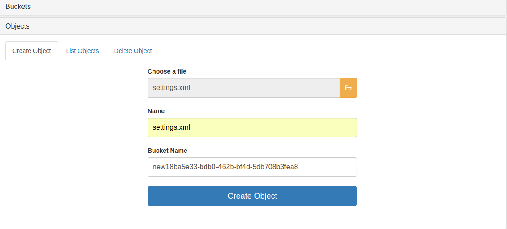
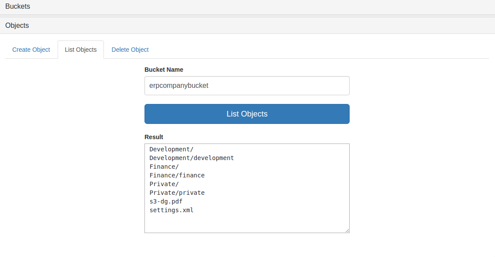
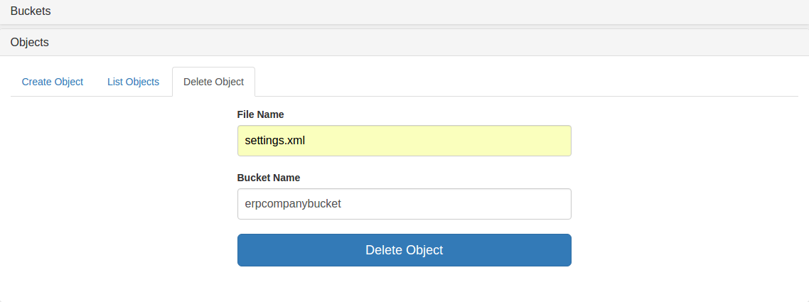

S3 Anypoint&trade; Connector Demo - Buckets and Objects CRUD
==========================================================

## Introduction

The present demo application provides a **complete workflow** to sequentially invoke some of S3's **standard operations**.

## Prerequisites

* Java 8
* Anypoint Studio 7.0.x or higher
* Mule Runtime 4.0.x EE or higher
* DataWeave
* Access to a Amazon S3

## Import the project

* Go to **File > Import**
* Select **Anypoint Studio Project from External Location** (under the parent folder "Anypoint Studio")
* Provide the root path to the demo project folder.
* Select Mule Runtime (4.0.x EE).
* Click **Finish**.
* Set S3 credentials inside the file `src/main/resources/mule-artifact.properties`. This may vary depending on the selected connection configuration. The current demo uses **S3 Access Key, Secret Key**:

    ```
    s3.accessKey=**************
    s3.secretKey=**************
    ```

* Open the **Global Element Configuration**.
* Fill Access Key and Secret Key as `${s3.accessKey}` and `${s3.secretKey}` respectively. 
* Click the **Test Connection** button to ensure there is connectivity with the sandbox. A successful message should pop-up.

* Open a browser and access the URL **http://localhost:8081**. You should see the demo application deployed:

## About the flows

* **create-bucket-flow:** This flow creates the bucket in amazon S3.

* **list-buckets-flow:** This flow lists the all buckets belongs to the authenticated user.

* **delete-bucket-flow:** This flow removes the specified bucket which was created by the authenticated user earlier.
    
* **create-object-flow:** This flow creates/stores file/object in the specified S3 bucket.

* **list-objects-flow:** given a bucket name, lists the all objects in the bucket. 

* **delete-object-flow:** Deletes the specified file/object from the specified S3 bucket.

### Additional flows

* **Html_Form_Flow:** renders the HTML form.

## Run the demo

### Create Bucket



* Provide a **Bucket Name** to be created.
* Click the button **Create Bucket** and wait a few moments to finish processing.
* If successfully created:
    * You should see the created bucket in the below **Result Box** 
### List Buckets



* Click the button **List Buckets** and wait a few moments to finish processing.
* If found, the list of the buckets will be displayed inside the **Result** textarea.

### Delete Bucket



* Provide the **Bucket Name** of an existing bucket to be deleted.
* Click the button **Delete Bucket** and wait a few moments to finish processing.
* If successfully deleted, the deleted bucket show in the below **Result** text area.


### Create Object



* Click on the folder icon and select a file from your local directory.
* Provide a **Name** for the file.
* Provide a **Bucket Name** in which the file/object needs to be stored.
* Click the button **Create Object** and wait a few moments to finish processing.
* After finised the processing, you will see the successful alert message.

### List Objects



* Provide a **Bucket Name** In which you want to list the objects.
* Click the button **List Objects** and wait a few moments to finish processing.
* After finished processing, you will see the list of objects in the below **Result** text area.

### Delete Object



* Provide a **File Name** or object to be deleted.
* Provide a **Bucket Name** in which above mentioned file/object exists.
* Click the button **Delete Object** and wait a few moments to finish processing.
* After fininsed processing you will get successful alert message.

## See more

* For additional technical information on the S3 Connector, visit our [technical reference documentation](http://mulesoft.github.io/s3-connector/) or refer to the [S3 Documentation Site](https://docs.mulesoft.com/mule-user-guide/v/3.8/amazon-s3-connector).
* For more information on the S3 API, go to the [S3 API documentation page](https://aws.amazon.com/documentation/s3/).
